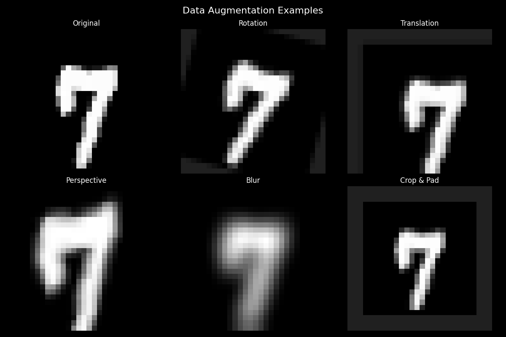

# Machine Learning Project

[](https://github.com/Shilpaj1994/BasicMLOps/actions/workflows/ml-pipeline.yml)

This repository contains a machine learning project with a complete training pipeline and GitHub Actions workflow integration.

## Data Augmentation Examples

Before training, the model visualizes various augmentation techniques applied to a sample MNIST digit:



The following augmentations are applied:
- Center Crop: Crops the center portion of the image
- Random Rotation: Rotates the image between -15 and 15 degrees
- Random Affine: Applies random affine transformations
- Random Perspective: Applies perspective transformations
- Gaussian Blur: Applies Gaussian blur with random sigma

## Project Structure

```
├── model.py # Model architecture definition
├── data_module.py # Data loading and preprocessing
├── train.py # Training script
├── test_model.py # Unit tests for the model
├── .github/
│ └── workflows/
│ └── ml-pipeline.yml # CI/CD pipeline configuration
```

## Setup

### Prerequisites
- Python 3.8 or higher
- pip (Python package installer)

### Installation

1. Clone the repository:
```bash
git clone https://github.com/Shilpaj1994/BasicMLOps.git
cd BasicMLOps
```

2. Create and activate a virtual environment (recommended):
```bash
python -m venv venv
source venv/bin/activate
```

3. Install dependencies:
```bash
pip install -r requirements.txt
```

## Usage

### Training the Model

To train the model, run:
```bash
python train.py
```

You can customize training parameters using command-line arguments:
```bash
python train.py --batch-size 32 --epochs 100 --learning-rate 0.001
```

### Testing

Run unit tests with:
```bash
pytest test_model.py
```

The test suite includes the following test cases:

1. Model Architecture Tests:
   - Verifies correct input/output dimensions
   - Checks if model parameters are initialized properly
   - Ensures all layers are properly connected

2. Data Processing Tests:
   - Validates MNIST data loading and preprocessing
   - Confirms correct image dimensions and normalization
   - Verifies augmentation pipeline functionality
   - Tests batch generation and data loader operations

3. Training Pipeline Tests:
   - Checks if model can overfit a small batch
   - Validates loss calculation and backpropagation
   - Tests optimizer step and learning rate scheduling
   - Ensures proper GPU/CPU device handling

4. Model Output Tests:
   - Verifies output probability distributions
   - Checks prediction shape and value ranges
   - Tests model behavior with edge cases
   - Validates model inference time

5. Model Saving/Loading Tests:
   - Verifies model checkpoint saving
   - Tests loading model from checkpoints
   - Validates state dict consistency
   - Ensures loaded model produces identical outputs

To run tests with coverage report:
```bash
pytest -vsk .
```

This will generate a detailed coverage report showing which parts of the code are tested.

## CI/CD Pipeline

This project includes a GitHub Actions workflow that:
- Runs tests on every push and pull request
- Validates code formatting
- Executes the training pipeline
- Reports test coverage
- Saves the model to the artifacts folder


## Author

Shilpaj Bhalerao - [@Shilpaj1994](https://github.com/Shilpaj1994)
Project Link: [https://github.com/Shilpaj1994/BasicMLOps](https://github.com/Shilpaj1994/BasicMLOps)